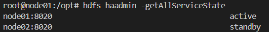
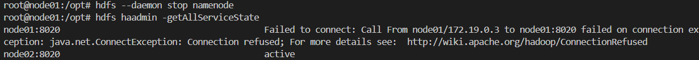
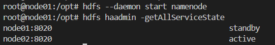
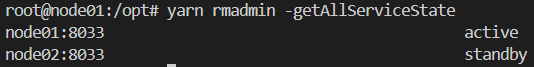
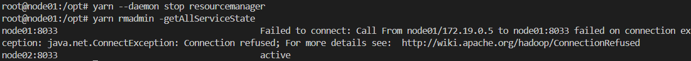
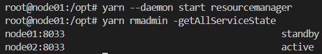

# 🐘 Hadoop High Availability (HA) Cluster

This project demonstrates a **High Availability Hadoop Cluster** running on **WSL + Docker**.

---

## 📊 Architecture


---

## 🧠 Overview

The cluster is designed to eliminate single points of failure across both:

* **HDFS (Storage Layer)**
* **YARN (Resource Management Layer)**

It achieves this using:

* Active / Standby NameNodes
* Active / Standby ResourceManagers
* ZooKeeper-based failover
* JournalNodes quorum for consistency

---

## 🔷 Core Components

### 1. HDFS - NameNode (HA)

* **Active NameNode**

  * Handles all client metadata operations
  * Writes edit logs to JournalNodes

* **Standby NameNode**

  * Continuously syncs from JournalNodes
  * Automatically takes over on failure

---

### 2. YARN - ResourceManager (HA)

* **Active ResourceManager**

  * Handles scheduling and resource allocation
  * Communicates with NodeManagers

* **Standby ResourceManager**

  * Remains in sync and ready for failover
  * Takes over automatically if Active fails

* Failover is coordinated using **ZooKeeper**

---

### 3. ZooKeeper Ensemble

* Runs on 3 nodes (node01, node02, node03)
* Responsible for:

  * Leader election
  * Failover coordination
  * Preventing split-brain scenarios

---

### 4. ZK Failover Controller (ZKFC)

* Runs on both NameNodes
* Monitors health and triggers failover
* Communicates with ZooKeeper

---

### 5. JournalNodes

* Store HDFS edit logs
* Use quorum-based writes (majority required)
* Ensure consistency between NameNodes

---

### 6. Worker Nodes

* **DataNodes** → store actual data blocks
* **NodeManagers** → execute YARN containers

---

## ⚙️ Startup Flow

1. Start ZooKeeper Ensemble
2. Start JournalNodes
3. Initialize NameNode (format)
4. Initialize shared edits
5. Bootstrap Standby NameNode
6. Start NameNodes (Active / Standby)
7. Start ZK Failover Controllers (ZKFC)
8. Start DataNodes
9. Start ResourceManagers (HA)
10. Start NodeManagers

---

## 🔁 How It Works

### HDFS

* Active NameNode writes metadata changes to JournalNodes
* Standby continuously reads and applies these changes

### YARN

* Active ResourceManager schedules jobs
* NodeManagers execute tasks
* Standby ResourceManager is ready for failover

---

## 🔄 Failover Verification

### HDFS (NameNode HA)

**Before Failure**



**State:**
node01 is Active and handling requests, while node02 is in Standby mode.

**Stop Active NameNode**



**Result:**
After stopping node01, it becomes unreachable and node02 is automatically promoted to Active.

**After Restart NameNode**



**State:**
node01 rejoins the cluster as Standby, while node02 remains Active.

**Conclusion:**
This demonstrates automatic failover and recovery in the HDFS HA setup.

---

### YARN (ResourceManager HA)

**Before Failure**

```bash
yarn rmadmin -getAllServiceState
```



**State:**
node01 is Active and managing cluster resources, while node02 is in Standby mode.

**Stop Active ResourceManager**



**Result:**
After stopping node01, it becomes unreachable and node02 is automatically promoted to Active.

**After Restart ResourceManager**

```bash
yarn rmadmin -getAllServiceState
```



**State:**
node01 rejoins as Standby, while node02 remains Active.

**Conclusion:**
This confirms automatic failover and recovery in the YARN HA setup.


---
## 🗂️ Cluster Layout

| Node   | Components                                              |
| ------ | ------------------------------------------------------- |
| node01 | NameNode, ResourceManager, ZKFC, ZooKeeper              |
| node02 | NameNode, ResourceManager, ZKFC, JournalNode, ZooKeeper |
| node03 | DataNode, NodeManager, ZooKeeper                        |
| node04 | DataNode, NodeManager, JournalNode                      |
| node05 | DataNode, NodeManager, JournalNode                      |

---


## 🌐 Access

* **HDFS UI**
  http://127.0.0.1:9870

* **YARN UI**
  http://127.0.0.1:8088

> ⚠️ On WSL use `127.0.0.1` instead of `localhost`

---

## 📌 Key Concepts

* High Availability across **Storage & Compute layers**
* Quorum-based consistency
* ZooKeeper-based coordination
* Separation of concerns (HDFS vs YARN)

---

## 🧠 Summary

> This cluster achieves full high availability by combining HDFS HA (Active/Standby NameNodes) with YARN HA (Active/Standby ResourceManagers), coordinated via ZooKeeper and backed by a quorum-based JournalNode system.

---
## 📚 Resources

- [HDFS High Availability Guide](https://hadoop.apache.org/docs/stable/hadoop-project-dist/hadoop-hdfs/HDFSHighAvailabilityWithQJM.html)

- [YARN ResourceManager High Availability](https://hadoop.apache.org/docs/stable/hadoop-yarn/hadoop-yarn-site/ResourceManagerHA.html)

- [ZooKeeper Documentation](https://zookeeper.apache.org/doc/current/)

- [Hadoop Architecture Overview](https://hadoop.apache.org/docs/stable/hadoop-project-dist/hadoop-common/ClusterSetup.html)

- [Hadoop Learning Series](https://www.youtube.com/watch?v=3PAl0y067Ag&list=PLrooD4hY1QqAK5pbBpcthLuMa-cXnXJLE)
---

## ⭐

If this project helped you, consider giving it a star ⭐
